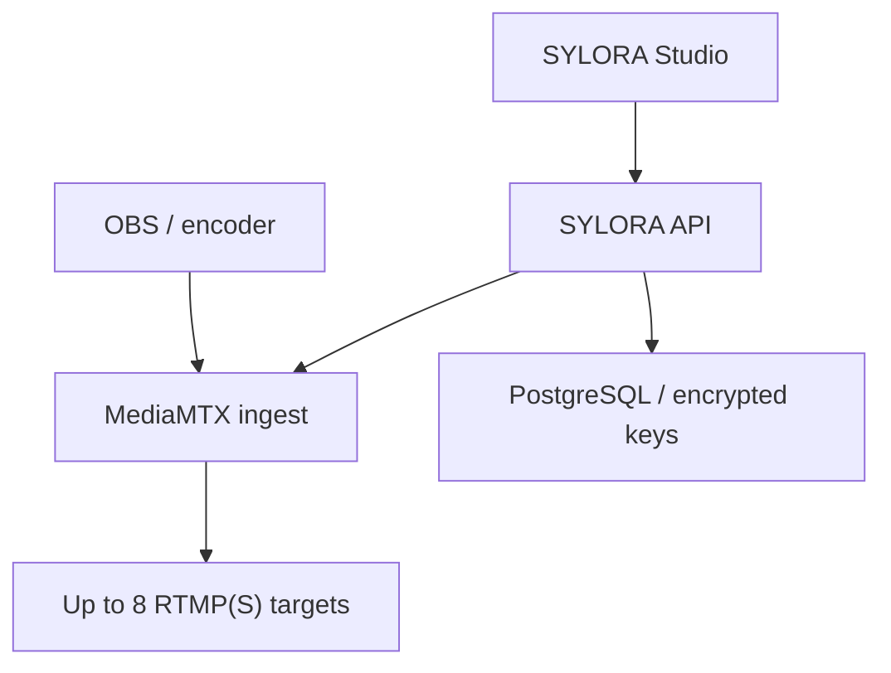

# SYLORA LIVE distribution

Status: **code-ready foundation; external platform credentials, public DNS and TLS are still required for production**.

## Product decision

The useful pattern in Restream's 2024 comparison is not to make SYLORA depend on one vendor. It is to combine the strongest product ideas behind one SYLORA control plane:

| Source pattern | What SYLORA adopts | Current state |
|---|---|---|
| Restream | One ingest, simultaneous fan-out, one Studio workflow, recording | Implemented for RTMP(S) destinations |
| YouTube / Facebook / LinkedIn | Scheduled event and replay lifecycle | Connector backlog |
| Twitch / Kick / TikTok | Fast chat, moderation, gifts and creator interaction | SYLORA-native chat/gifts work; official external event adapters remain backlog |
| Vimeo / IBM Video | Branded professional events, privacy and analytics | Enterprise policy and analytics backlog |
| Wowza / Brightcove / Kaltura | Multi-bitrate delivery, APIs, CDN and scale | Transcoding/CDN backlog |
| Dacast | Protected or paid events | Entitlement/paywall backlog |
| Panopto | Searchable recordings and DVR | Recording exists at the router; catalog, playback and search remain backlog |

The first production-oriented slice is therefore a vendor-independent distribution layer. Restream can itself be configured as one destination, but it is not a hard dependency.

## Runtime architecture



1. A creator adds a destination in Studio with its platform RTMP(S) server and stream key.
2. The API validates the provider host, rejects local/private targets and encrypts the stream key with AES-256-GCM.
3. Starting distribution creates a high-entropy MediaMTX path and configures native forward targets through its authenticated internal Control API.
4. The OBS server and ingest key are returned in the start response once. Later status responses expose only its fingerprint.
5. MediaMTX forwards the same encoded input to each selected destination and can optionally retain an fMP4 safety recording for seven days.
6. Studio polls aggregate source bytes and sanitized per-destination forwarding state. Router errors never expose destination URLs or stream keys.
7. Stopping distribution deletes the dynamic router path and marks the session stopped. An active destination cannot be edited or deleted until the session stops.
8. If a router restart loses an in-memory dynamic path, status marks the session failed. It never silently reactivates external publishing; the creator starts a new session and receives a new ingest key.

## Implemented API

| Method | Path | Purpose |
|---|---|---|
| `GET` | `/api/studio/distribution` | Public provider catalog, secret-free destination list and configuration state |
| `POST` | `/api/studio/distribution/destinations` | Validate and create an encrypted destination |
| `PATCH` | `/api/studio/distribution/destinations/:id` | Update an inactive destination |
| `DELETE` | `/api/studio/distribution/destinations/:id` | Delete an inactive destination |
| `POST` | `/api/live/:id/distribution/preflight` | Check router, credentials, encryption and selected destinations |
| `POST` | `/api/live/:id/distribution/start` | Create router path and return one-time OBS ingest details |
| `GET` | `/api/live/:id/distribution` | Secret-free source and per-destination status |
| `POST` | `/api/live/:id/distribution/stop` | Remove router path and stop fan-out |

All endpoints require an authenticated user. LIVE session endpoints additionally require that user to own the LIVE room.

## Security invariants

- `SYLORA_STREAM_SECRET_KEY` is exactly 32 bytes (64 hexadecimal or 43-character unpadded base64url) and never enters public config or logs.
- Destination keys and generated ingest paths use AES-256-GCM with record-specific authenticated context. Domain-separated keys are derived for encryption and the short HMAC fingerprint stored for safe identification.
- Destination stream keys never appear in list, status or error responses. The one-time SYLORA ingest key appears only in a successful start response.
- The MediaMTX Control API is authenticated separately and is not published as a host port by Compose.
- The bundled config allows anonymous RTMP **publish only**. Dynamic paths are created just in time and are high entropy; reading is not allowed.
- Production ingest and destinations require RTMPS. Plain RTMP is a development compatibility mode unless `SYLORA_STREAM_ALLOW_INSECURE_RTMP=1` is deliberately set.
- Known provider hosts are constrained by suffix. Enterprise/custom hosts require `SYLORA_STREAM_ALLOWED_HOSTS`; their DNS results are rejected if they resolve to local, private, link-local, documentation or other non-public addresses.
- Forward errors are reduced to state, protocol, byte count and a boolean error indicator. Raw MediaMTX errors may include sensitive target data and are never returned or persisted.
- MediaMTX runs at `warn` log level by default. Error logs can still contain router context, so production log access and retention must be restricted and logs must never be attached publicly.
- MediaMTX requires `%path` in recording paths. Since the high-entropy publish path is the temporary ingest credential, the recording volume is server-sensitive and must never be exposed or mounted into the public app. Stopping the session deletes the live router path; retained recordings still require restricted operator access.
- DNS validation is defense in depth, not an outbound firewall. Restrict the router's egress to approved platform networks where operationally practical, especially when custom hosts are enabled.

Changing `SYLORA_STREAM_SECRET_KEY` makes existing encrypted destinations unreadable. Rotate it only with a migration/re-entry procedure; do not casually replace it during deploy.

## Local development

Generate independent server-only values:

```bash
openssl rand -hex 32 # SYLORA_STREAM_SECRET_KEY
openssl rand -hex 32 # SYLORA_MEDIA_ROUTER_CONTROL_PASSWORD
```

For a local Node process, use:

```env
SYLORA_MEDIA_ROUTER_CONTROL_URL=http://127.0.0.1:9997
SYLORA_MEDIA_ROUTER_CONTROL_USER=sylora-control
SYLORA_MEDIA_ROUTER_CONTROL_PASSWORD=<64-hex-value>
SYLORA_MEDIA_ROUTER_PUBLIC_RTMP_URL=rtmp://127.0.0.1:1935
SYLORA_STREAM_SECRET_KEY=<different-64-hex-value>
```

Start the router with the same Control API credentials, or start the Compose profile with an environment file:

```bash
docker compose --env-file .env.local --profile streaming up -d mediamtx
```

## Production setup

Place a public certificate and key at `<tls-dir>/server.crt` and `<tls-dir>/server.key`, then configure values similar to:

```env
SYLORA_MEDIA_ROUTER_CONTROL_URL=http://mediamtx:9997
SYLORA_MEDIA_ROUTER_CONTROL_USER=sylora-control
SYLORA_MEDIA_ROUTER_CONTROL_PASSWORD=<64-hex-value>
SYLORA_MEDIA_ROUTER_PUBLIC_RTMP_URL=rtmps://stream.example.com:443
SYLORA_STREAM_SECRET_KEY=<different-64-hex-value>
SYLORA_RTMP_BIND_ADDRESS=0.0.0.0
SYLORA_RTMP_ENCRYPTION=strict
SYLORA_RTMPS_PORT=443
SYLORA_RTMP_TLS_CERT_DIR=/absolute/host/path/to/stream-cert
```

Use `http://mediamtx:9997` inside Compose. `127.0.0.1:9997` points back to the SYLORA application container and is wrong there.

Only the public RTMPS TCP port should be opened at the host firewall. Ports `9997` (Control API) and `9998` (metrics) stay on the Compose network. Start with:

```bash
docker compose --env-file .env.local --profile streaming up -d --build
```

Then use Studio's preflight before supplying real platform keys. A healthy container alone is not proof: run an OBS test into the one-time ingest and confirm every selected destination reports `forwarding`.

## Encoder compatibility

MediaMTX forwards tracks; it does not normalize every destination into a separate rendition. For the initial common profile use H.264 video, AAC stereo audio, CBR, a two-second keyframe interval, and a resolution/bitrate accepted by **all** selected targets. Do not mix a platform that requires incompatible encoder settings in the same distribution session.

Per-destination transcoding, adaptive bitrate ladders and CDN playback belong in the next media-compute slice, not in this router process.

## Explicit limitations

- External account authorization and stream keys are not provisioned by SYLORA.
- YouTube/Facebook/LinkedIn event scheduling and metadata APIs are not connected yet.
- External platform chats are not unified yet. The existing TikTok/TikFinity owner pilot remains local and is not an official TikTok API.
- The browser Studio canvas is not sent directly to MediaMTX; this slice uses OBS or another RTMP(S) encoder.
- Recordings are retained by MediaMTX but are not yet indexed into SYLORA media, object storage or a playback UI.
- There is no per-destination transcoding, failover router, multi-region ingest, CDN egress or automated bandwidth billing guard yet.

Those gaps must remain visible in product copy and release notes.
