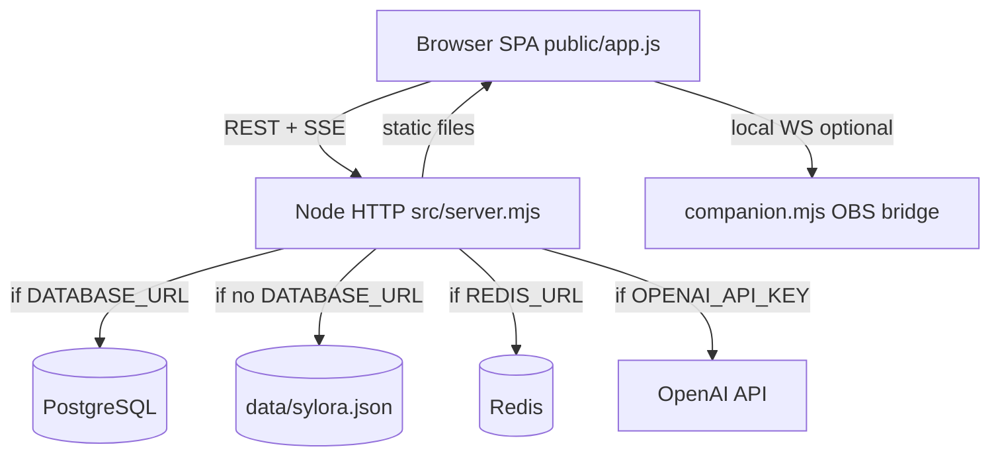

# SYLORA — Architecture Map (As-Is, Verified 2026-08-13)

> Source of truth derived from repository inspection + runtime checks. Not from README or prior agent reports.

## Repository topology

```
Project-Sylora-2/
├── src/                    # Node.js backend (ESM)
│   ├── server.mjs          # HTTP server, core API (~590 LOC)
│   ├── store.mjs           # JSON file persistence (dev fallback)
│   ├── auth.mjs            # scrypt password + bearer tokens
│   ├── companion.mjs       # OBS WebSocket bridge (separate process)
│   ├── infra/              # postgres.mjs, redis.mjs
│   ├── repositories/       # Postgres repos (auth, wallet, ai, live, ecosystem, outbox, conference)
│   └── ecosystem/          # Mega-module: service.mjs (~3885 LOC), routes.mjs (~1215 LOC), 40+ domain files
├── public/                 # Static SPA + assets (~45MB PNG/SVG)
│   ├── index.html          # Shell + 11 CSS + importmap for Three.js
│   ├── app.js              # Entire frontend SPA (~897 LOC)
│   ├── gift-engine.js, gift-gpu-engine.js, gift-v2/*, gift-runtime.js
│   ├── obs-overlay.html/js, phoenix-preview.html/js
│   └── assets/             # PNG atlases, avatar sprites, phoenix keyframes
├── infra/postgres/         # schema.sql + 11 migrations (002–012)
├── tests/                  # 134 Node test files (*.test.mjs), no Playwright/Cypress
├── scripts/                # migrate.mjs, deploy-prod.sh, patch scripts
├── sdk/js/                 # Minimal JS SDK stub
├── compose.yaml + Dockerfile
└── docs/                   # Design docs + prior audits (not authoritative)
```

## Runtime architecture (actual)



### Persistence modes

| Mode | Trigger | Evidence |
|------|---------|----------|
| JSON dev runtime | `DATABASE_URL` empty | `GET /api/health` → `persistence: json-dev-runtime` (verified runtime) |
| Postgres hybrid | `DATABASE_URL` set | `authSocial.enabled`, wallet/ai/live repos; migrations in `infra/postgres/migrations/` |
| Ecosystem cache | Always | Large JSON arrays in `store.data` + optional `PostgresEcosystemRepository` |

Production `compose.yaml` expects Postgres 17 + Redis 8 + migrate on boot.

## API surface

| Layer | Count | Files |
|-------|-------|-------|
| Core routes | ~90 | `src/server.mjs` |
| Ecosystem routes | ~206 | `src/ecosystem/routes.mjs` |
| **Total HTTP endpoints** | **296** | Grep-verified |
| SSE streams | 6 | `/api/events`, `/api/gifts/stream`, `/api/live/:id/events`, `/api/conferences/:id/events`, `/api/calls/:id/events`, `/api/studio/browser-source/events` |
| WebSocket on `/api/*` | 0 | Signaling via HTTP POST + SSE fanout |

## Frontend architecture

- **Single-page app**: one `app.js`, pathname routing via `SPA_SHELL_VIEWS` (21 views).
- **No React/Vue/Svelte** — vanilla JS string templates.
- **No build step for UI** — `npm run build` only syntax-checks JS.
- **Design**: 11 stacked CSS files (v2–v6, consolidation, avatar, etc.).

## Realtime / media

| Feature | Implementation | Production-ready? |
|---------|----------------|-------------------|
| Live WebRTC | HTTP signaling + SSE; `LivePeerRegistry` + optional Redis | Functional locally; needs TURN for NAT |
| Calls / conferences | Same pattern via `call-engine`, `conference-fanout` | Code exists; browser E2E not verified in audit |
| Live chat / gifts | SSE fanout | Verified API + SSE endpoint exists |
| Video upload | Raw POST to `/api/media/upload`; ffmpeg HLS in-process | Requires ffmpeg (present on audit VM) |
| OBS | `companion.mjs` + browser overlay token | Companion not started in audit |
| RTMP / CDN streaming | **Not present** | — |

## AI architecture

| Component | Location | Status |
|-----------|----------|--------|
| Text chat | `runSyloraAi()` in server.mjs + OpenAI Responses API | **BLOCKED** without `OPENAI_API_KEY` (503 verified) |
| Tool calling | `get_my_context`, `propose_post`, `propose_memory` | Implemented; needs OpenAI |
| Voice realtime | POST `/api/ai/realtime` → OpenAI Realtime HTTP | **BLOCKED** without key |
| Memory | JSON or `postgres-ai`; manual + confirmed actions | Works without OpenAI (CRUD verified) |
| Living Sylora / director | `ecosystem/living-sylora/`, platform events | In-memory + optional AI hook |
| Ecosystem intelligence | `ecosystem/service.mjs` (3000+ LOC) | Many endpoints; ~150 without frontend callers |

## Security boundaries (implemented)

- Bearer session tokens (SHA-256 hashed at rest in Postgres mode)
- Rate limits: in-memory + optional Redis (`allowRequest`, `allowAi`)
- CSP, X-Frame-Options, nosniff (`securityHeaders()`)
- Admin via `SYLORA_ADMIN_EMAILS` env
- Password: scrypt (`auth.mjs`)

## What is NOT in the architecture

- Separate frontend/backend repos
- Microservices (monolith)
- Mobile native apps
- CI/CD pipelines (no `.github/workflows`)
- Kubernetes / Terraform
- Real payment provider
- Google OAuth flow (env placeholders only)
- Email verification / password recovery
- CDN / object storage (media on local disk)

## Deprecated / experimental signals

- `renderProfileLegacy()` in app.js — dead code, superseded by `renderProfile()`
- Multiple `scripts/patch-*.mjs` — one-off migration patches
- Prior `docs/audit/*.md` reports — superseded by this forensic baseline
- `docs/FINAL_IMPLEMENTATION_REPORT.md` — do not trust without verification

## Test architecture

- **134 Node native tests** (`npm test` with empty DATABASE_URL/REDIS_URL)
- Covers: API E2E slices, postgres repos (pg-mem), gifts, motion, security headers, RTC config
- **No browser E2E** in CI sense; `tests/avatar-ui.test.mjs` checks file existence only
