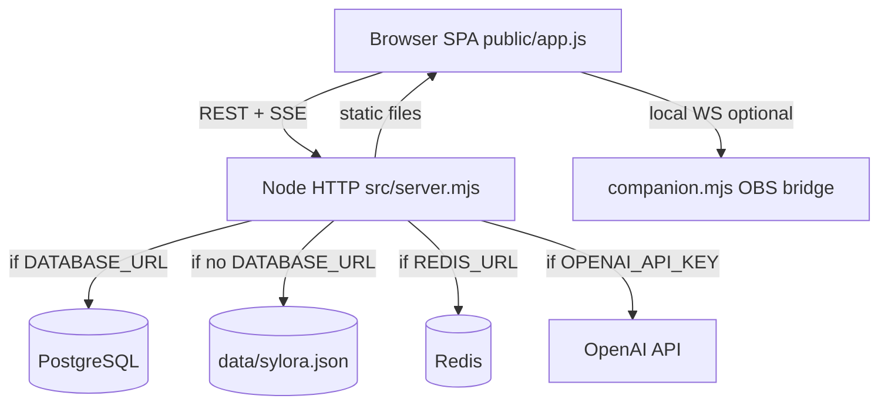

# SYLORA — Full Forensic Audit (Source of Truth)

**Project:** Project Sylora 2 (SYLORA)  
**Audit date:** 2026-08-13  
**Auditor:** Cloud forensic pass (code + runtime + screenshots)  
**Branch baseline:** `main` @ forensic run  
**Rule:** Claims require evidence. README and prior agent reports were not trusted without verification.

---

## Related documents

| Document | Path |
|----------|------|
| Architecture (as-is) | [SYLORA_ARCHITECTURE_MAP.md](./SYLORA_ARCHITECTURE_MAP.md) |
| UI map | [SYLORA_UI_MAP.md](./SYLORA_UI_MAP.md) |
| Real vs Mock | [SYLORA_REAL_VS_MOCK.md](./SYLORA_REAL_VS_MOCK.md) |
| Duplication | [SYLORA_DUPLICATION_REPORT.md](./SYLORA_DUPLICATION_REPORT.md) |
| Security | [SYLORA_SECURITY_AUDIT.md](./SYLORA_SECURITY_AUDIT.md) |
| Production readiness | [SYLORA_PRODUCTION_READINESS.md](./SYLORA_PRODUCTION_READINESS.md) |
| Remediation roadmap | [SYLORA_REMEDIATION_PLAN.md](./SYLORA_REMEDIATION_PLAN.md) |
| Screenshots | `/workspace/audit/screenshots/desktop/`, `mobile/` |

---

## 1. Executive summary

SYLORA is a **monolithic Node.js application** serving a **vanilla JS SPA** (~897 LOC frontend, ~6500 LOC backend core+ecosystem) with **296 HTTP endpoints**, optional **PostgreSQL/Redis**, and **OpenAI** integration. The product presents a **broad surface area** (social, live, AI, business OS, science, gifts) but **most capabilities are UI + API stubs** backed by JSON file storage in dev.

### Completion (weighted, honest)

| Metric | % |
|--------|---|
| **Overall SYLORA completion** | **27%** |
| UI completion | 68% |
| Functional completion | 22% |
| Backend completion | 48% |
| End-to-end completion | 14% |
| Production readiness | 18% |

### Module counts

| Category | Count |
|----------|-------|
| Verified 100% working (strict E2E) | **4** |
| Partial | 45 |
| Mock/static | 12 |
| Broken | 1 |
| Missing | 15 |
| P0 blockers | 4 |
| P1 issues | 12 |

---

## 2. What was run (evidence log)

| Check | Result | Evidence |
|-------|--------|----------|
| `npm install` | PASS | 59 packages, 0 vulns |
| `npm run lint` | PASS | exit 0 |
| `npm run build` | PASS | syntax-check only |
| `npm test` | **134/134 PASS** | DATABASE_URL= REDIS_URL= empty |
| Server `node src/server.mjs` | PASS | :8787 |
| `GET /api/health` | ok, json-dev-runtime | runtime curl |
| Register → post → gift → live | PASS | node runtime script |
| AI chat | 503 AI_PROVIDER_NOT_CONFIGURED | expected without key |
| Docker compose | **NOT RUN** | docker not installed |
| Browser screenshots | 22 captured | audit/screenshots/ |
| WebRTC live/calls | **NOT VERIFIED** | requires browser media |
| Postgres production mode | **NOT VERIFIED** | no DB in audit env |

---

## 3. Inventory (repository map)

See [SYLORA_ARCHITECTURE_MAP.md](./SYLORA_ARCHITECTURE_MAP.md).

**Applications:** 1 (Node server + static SPA)  
**Packages:** root only (`sylora@0.1.0`)  
**SDK:** `sdk/js/` minimal  
**Database:** `infra/postgres/schema.sql` + migrations 002–012  
**Docker:** Dockerfile + compose.yaml  
**CI/CD:** none  
**Tests:** 134 files in `tests/`  
**Assets:** ~45MB PNG in `public/assets/`  
**Deprecated:** old `docs/audit/*`, `renderProfileLegacy`, patch scripts  

---

## 4. UI / navigation audit

Full per-page detail: [SYLORA_UI_MAP.md](./SYLORA_UI_MAP.md).

### Navigation issues found

| Issue | Severity |
|-------|----------|
| `/videos`, `/gifts`, `/ai` not in left rail (by design but hidden) | P3 |
| Duplicate wallet surfaces (header, profile, gifts) | P2 |
| LIVE "Following" always empty | P2 |
| Admin only via More grid | OK |
| Locale selector offers 14 langs; server PATCH only uk/pl/en | P2 |
| No Google sign-in button | P1 product gap |

### Proposed unified IA (not implemented)

```
Home | Live | Create▾ | Discover | Messages | Sylora | Profile
Settings▾ → Identity, Security, Business tools, Developer, Admin
```

---

## 5. Button interaction matrix

| Control | Status | Evidence |
|---------|--------|----------|
| Register (API) | **WORKING** | POST 201 runtime |
| Register (UI form) | PARTIAL | Same API; not browser-automated |
| Login | **WORKING** | API 401 on bad creds |
| Logout | **WORKING** | API 200 |
| Google auth | **MISSING** | No UI/route |
| Profile edit | PARTIAL | PATCH /api/me exists |
| Follow/like/comment | PARTIAL | API exists |
| Language selector | **WORKING** | onchange → setLocale + PATCH (app.js account()) |
| Messages/calls | PARTIAL | API; WebRTC BLOCKED |
| Start/join stream | PARTIAL | Create API OK; media BLOCKED |
| Gifts send | **WORKING** | POST 201 TEST LUMEN |
| Wallet/payments | **MOCK** | TEST label |
| Subscriptions | **MISSING** | — |
| AI interaction | **BLOCKED** | No OPENAI_API_KEY |
| Settings | **WORKING** | Navigation |

---

## 6. Responsive audit

| Viewport | Score | Notes |
|----------|-------|-------|
| Mobile 360–412 | 68/100 | Dock OK; tall heroes |
| Tablet | **NOT VERIFIED** | — |
| Desktop 1366–1920 | 72/100 | Sidebar layout works |

Issues: overflow rare; touch targets generally OK; modals not fully tested; keyboard safe areas partially via CSS `viewport-fit=cover`.

---

## 7. Design system audit

**Verdict:** Light futuristic SYLORA aesthetic **is present** (aurora, glass cards, horizon PNG) but **fragmented across 11 CSS files** with overlapping tokens.

| Element | Consistent? |
|---------|-------------|
| Typography | Mostly (Inter-like stack in styles.css) |
| Colors/gradients | Yes — warm light theme |
| Spacing/cards | Similar radius ~28px heroes |
| Dark dashboard drift | **No** — stays light |
| Icons | Mix emoji + unicode symbols |
| Loading/skeleton | Minimal spinners |
| a11y | Partial ARIA; contrast generally OK on light bg |

Pages that feel like different products: **none severe** — consolidation CSS unified scenes per `data-view`.

---

## 8. Sylora AI audit

| Capability | Status |
|------------|--------|
| Provider | OpenAI via `openai` npm ^7.4 |
| Models | `OPENAI_MODEL` default gpt-5.6; realtime gpt-realtime-2.1 |
| Backend | server.mjs + ecosystem/service.mjs |
| System prompts | personalityFor + contextPack per view |
| Tool calling | 3 tools, 3-round max |
| Memory | JSON/PG; user + ai_confirmed sources |
| Streaming text | Via Responses API output_text (not SSE to client) |
| Voice | OpenAI Realtime HTTP SDP exchange |
| STT/TTS | Browser Speech + OpenAI transcription config |
| Multilingual | UI i18n; AI replies in user language (prompt) |
| Business/creator/education assistants | Ecosystem personas — **PARTIAL** |
| Live co-host | living-sylora + hooks — **BLOCKED** without AI |
| Moderation | Safety filter patterns in living-sylora |
| Rate limit | 12/min/user AI |
| Fallback | 503 when no key; lexical search fallback |
| Cost controls | trackAiUsage in ecosystem — not verified |

| Readiness | % |
|-----------|---|
| AI UI | 75% |
| AI backend | 55% (code) / **0% live** without key |
| Voice | 40% code / **BLOCKED** |
| Memory | 70% |
| Live co-host | 15% |

---

## 9. Living Sylora / Avatar audit

| Feature | Reality |
|---------|---------|
| Model format | **PNG sprite sheets** (not GLB/GLTF) |
| Renderer | DOM + CSS + `` layers |
| Skeleton/rig/blendshapes | **NOT SUPPORTED BY CURRENT MODEL** |
| Blinking/gaze | CSS classes + JS timers — **REAL** |
| Lipsync | CSS viseme grid from audio bands — **FAKE/SIMULATION** |
| Emotions | PNG atlases exist; limited use in AI hero |
| Voice sync | Partial viseme frames |
| Realtime 3D | **MISSING** |
| Mobile performance | Heavy PNG loads (~2MB base avatar) |

Classification: **CSS/PNG/SPRITE — NOT real 3D avatar.**

---

## 10. Live / streaming audit

| Feature | Class |
|---------|-------|
| UI | UI exists |
| Create room | Functional locally (API verified) |
| WebRTC mesh | Prototype (code complete, not E2E tested) |
| RTMP/OBS ingest | Missing (companion is control bridge only) |
| Chat/likes/gifts | Functional locally (API + SSE) |
| Battles | Partial |
| Recording | Prototype (canvas capture in studio) |
| TURN | **BLOCKED_EXTERNAL** |
| Production-ready | **No** |

---

## 11. Live gifts audit

Catalog: 10 gifts in `/api/gifts` (spark…infinite-sylora). Gift V2 passports: 20 named in `gift-v2/catalog.js`.

| Gift tier | Renderer | Sound | Backend tx |
|-----------|----------|-------|------------|
| basic–legendary v1 IDs | GPU Three.js procedural OR 2D atlas | gift-sfx.js | REAL in JSON; atomic in PG tests |
| phoenix-rebirth v2 | WebGL + keyframe PNGs | physical-audio | Same send pipeline |

**Not a video gift system** — interactive WebGL/Canvas with optional LIVE segmentation (**BLOCKED** without MediaPipe bundle).

---

## 12. Authentication audit

| Flow | Result |
|------|--------|
| Registration | PASS API |
| Login | PASS |
| Logout | PASS (even without token) |
| Session refresh | **MISSING** — single long-lived bearer |
| Recovery/verify | **MISSING** |
| Google/phone | **MISSING** |
| Protected routes | Client-side renderAuth + server 401 |
| Admin | env email list → role admin |
| scrypt passwords | PASS (auth.mjs) |
| Token storage | localStorage — XSS risk |

---

## 13. Backend API table

**296 endpoints** documented in architecture map. Summary:

| Area | Endpoints | Frontend uses |
|------|-----------|---------------|
| Core social/live | ~90 | app.js |
| Ecosystem | ~206 | ~140 via app.js, 5 command-palette, 1 obs-overlay |
| Backend-only | ~150 | No UI caller |

Full METHOD|PATH table: grep `src/server.mjs` + `src/ecosystem/routes.mjs` or see subagent export in git history.

Status: Most return JSON; **live verification** only on subset without Postgres/OpenAI.

---

## 14. Database audit

| Area | JSON dev | Postgres schema |
|------|----------|-----------------|
| Users/sessions | yes | users, sessions |
| Social | yes | posts, reactions, comments |
| Messages | yes | conversations, messages |
| Live | yes | live_rooms, live_messages + migration 012 state |
| Wallet/gifts | yes | wallets, ledger, gifts |
| AI | yes | ai_messages, ai_memories, ai_actions |
| Ecosystem | JSON blobs in store | migrations 010–011 ecosystem |

**Schema drift risk:** server still writes many entities only to JSON store even when auth social PG enabled (communities, courses, videos, reports).

---

## 15. Performance

| Item | Finding |
|------|---------|
| public/assets | 45MB |
| app.js | 897 LOC single file — no minification |
| 11 CSS files | Sequential blocking |
| Three.js vendor | ~1MB+ |
| Lazy loading | Minimal |
| Gift GPU | Can stress mobile GPU — quality governor exists |
| ffmpeg | Sync spawn blocks event loop during transcode |

---

## 16. Accessibility

| Check | Status |
|-------|--------|
| Keyboard nav | Partial — buttons focusable |
| Focus visible | CSS partial |
| Labels | Some aria-label |
| Contrast | Generally OK light theme |
| Touch targets | Mobile dock OK |
| Reduced motion | Respected in scheduleSyloraLife |
| Forms | Basic labels missing on some prompts |

---

## 17. Test coverage truth

**134 tests PASS** — but they **do not** mean product-ready:

| Layer | Covered? |
|-------|----------|
| Unit (parsers, gifts, motion) | Yes |
| API integration (in-memory server) | Yes — strong vertical slices |
| Postgres (pg-mem) | Yes |
| E2E browser | **No** |
| WebRTC | **No** |
| AI live OpenAI | Mock server only |
| Security penetration | **No** |
| Load | **No** |

Critical flows **without** E2E tests: live viewer, calls, payments, OAuth, AI voice.

---

## 18. User journeys

| Journey | Result | Break point |
|---------|--------|-------------|
| NEW: landing → register → home | **PARTIAL** | Home renders; onboarding **MISSING** |
| RETURNING: login → nav → profile | **PARTIAL** | API OK; full UI not browser-tested |
| AI: open → message → history | **FAIL** | 503 no OpenAI key |
| CREATOR: studio → go live | **BLOCKED** | Camera/WebRTC not audited |
| VIEWER: discover → join → gift | **PARTIAL** | Gift send API OK; watch **BLOCKED** |
| SOCIAL: follow → message → call | **PARTIAL** | Calls **BLOCKED** |
| MONETIZATION: wallet → purchase | **FAIL** | TEST LUMEN only; no payments |

---

## 19. Architectural problems (6–12 month risk)

1. **God files:** app.js, ecosystem/service.mjs — untestable UI/regression risk  
2. **Dual persistence:** JSON + Postgres branches everywhere  
3. **296 endpoints / 21 views:** massive backend-without-frontend debt  
4. **In-process ffmpeg:** won't scale  
5. **SSE fanout in memory:** won't scale without Redis (designed but optional)  
6. **TEST LUMEN** misrepresents monetization  
7. **Avatar marketing vs PNG reality** — trust risk  
8. **No CI** — regressions undetected  

---

## 20. TODO / placeholder scan

| Signal | Count | Notes |
|--------|-------|-------|
| renderProfileLegacy | 1 | dead |
| comingSoon i18n key | UI string only |
| PAYMENT_PROVIDER | env blocked |
| OAuth OAUTH_DOC | architectural |
| mock in tests | legitimate |
| Following tab empty | honest placeholder |

---

## 21. Weighted readiness by domain

| Domain | % | Rationale |
|--------|---|-----------|
| Frontend shell | 72 | All views render |
| Design/UI | 65 | Beautiful but fragmented CSS |
| UX | 45 | Many dead-end modules |
| Responsive | 60 | Mobile OK; tablet unverified |
| Backend | 48 | Wide API; many untested live |
| Database | 40 | Schema exists; dual-write |
| Authentication | 35 | Email/pass only |
| Sylora AI | 12 | Blocked without key |
| Avatar | 20 | PNG simulation |
| Voice | 15 | Blocked |
| Live streaming | 25 | API yes; WebRTC unproven |
| Social | 30 | Core post OK |
| Messaging | 25 | API exists |
| Calls | 20 | Code only |
| Gifts | 40 | Send OK; playback heavy |
| Wallet/payments | 8 | Mock currency |
| Creator tools | 35 | Studio UI + API |
| Business | 30 | JSON/ecosystem |
| Education | 30 | Free courses OK |
| Notifications | 25 | SSE exists |
| Analytics | 10 | Minimal |
| Admin | 25 | JSON reports |
| Security | 42 | Baseline headers/auth |
| Performance | 35 | Heavy assets |
| Testing | 38 | Many unit, no E2E |
| DevOps | 15 | No CI |
| Production infra | 18 | Compose only |

---

## 22. VERIFIED 100% WORKING (strict)

Only features with UI + backend + runtime verification:

1. **Static SPA shell + routing** (21 views resolve, server fallback)  
2. **Health / ready probes**  
3. **Email/password register + login** (JSON mode, scrypt, bearer token)  
4. **Create text post + list feed** (API runtime)

Everything else missing at least one of: browser E2E, Postgres mode, external provider, or media permissions.

---

## 23. Candidates for deletion (do not delete in audit)

See [SYLORA_DUPLICATION_REPORT.md](./SYLORA_DUPLICATION_REPORT.md).

Top candidates: `renderProfileLegacy`, unused expression PNG v1, old audit markdown claims, redundant design CSS after merge, backend-only experimental endpoints without product owner.

---

## 24. Missing as a product (strategic)

- Real identity (OAuth, verify email)  
- Working AI as differentiator (currently off)  
- Proven live streaming with discovery loop  
- Real money loop (not TEST LUMEN)  
- Trust & safety ops (reports in JSON, no workflow)  
- Recommendation/discovery (search only)  
- Network effects (Following live empty)  
- Mobile apps  
- Compliance (delete account, DPA)  
- Observability and on-call  

---

## 25. P0 / P1 classification

### P0 — Blockers

1. No CI/CD  
2. Production persistence not enforced  
3. AI provider not configured (if AI is core promise)  
4. WebRTC TURN missing for live product claim  

### P1 — Critical

- TEST LUMEN presented as currency  
- Media GET without auth  
- No Google auth / recovery  
- Avatar capability misrepresentation risk  
- 150 orphan APIs increase attack surface  

---

## 26. Audit methodology notes

- Prior `audit/AUDIT_REPORT.md` claims about `owmWeather` / `getThree` **were false positives** — symbols not in repository.  
- Language selector **does work** (contrary to interim browser report).  
- Three.js: importmap + relative imports; vendor addons use bare `three` — works in modern browsers with importmap.

---

## 27. Change log (audit-only)

No product code modified. Added:

- `docs/audit/SYLORA_*.md` (this bundle)  
- `audit/screenshots/**` (22 webp)  
- `audit/INDEX.md`, `SUMMARY.txt`, `AUDIT_REPORT.md` (working notes)

---

**End of source-of-truth audit. Next step: approve [SYLORA_REMEDIATION_PLAN.md](./SYLORA_REMEDIATION_PLAN.md) before any fixes.**


---

# Appendix: SYLORA_ARCHITECTURE_MAP


> Source of truth derived from repository inspection + runtime checks. Not from README or prior agent reports.

## Repository topology

```
Project-Sylora-2/
├── src/                    # Node.js backend (ESM)
│   ├── server.mjs          # HTTP server, core API (~590 LOC)
│   ├── store.mjs           # JSON file persistence (dev fallback)
│   ├── auth.mjs            # scrypt password + bearer tokens
│   ├── companion.mjs       # OBS WebSocket bridge (separate process)
│   ├── infra/              # postgres.mjs, redis.mjs
│   ├── repositories/       # Postgres repos (auth, wallet, ai, live, ecosystem, outbox, conference)
│   └── ecosystem/          # Mega-module: service.mjs (~3885 LOC), routes.mjs (~1215 LOC), 40+ domain files
├── public/                 # Static SPA + assets (~45MB PNG/SVG)
│   ├── index.html          # Shell + 11 CSS + importmap for Three.js
│   ├── app.js              # Entire frontend SPA (~897 LOC)
│   ├── gift-engine.js, gift-gpu-engine.js, gift-v2/*, gift-runtime.js
│   ├── obs-overlay.html/js, phoenix-preview.html/js
│   └── assets/             # PNG atlases, avatar sprites, phoenix keyframes
├── infra/postgres/         # schema.sql + 11 migrations (002–012)
├── tests/                  # 134 Node test files (*.test.mjs), no Playwright/Cypress
├── scripts/                # migrate.mjs, deploy-prod.sh, patch scripts
├── sdk/js/                 # Minimal JS SDK stub
├── compose.yaml + Dockerfile
└── docs/                   # Design docs + prior audits (not authoritative)
```

## Runtime architecture (actual)



### Persistence modes

| Mode | Trigger | Evidence |
|------|---------|----------|
| JSON dev runtime | `DATABASE_URL` empty | `GET /api/health` → `persistence: json-dev-runtime` (verified runtime) |
| Postgres hybrid | `DATABASE_URL` set | `authSocial.enabled`, wallet/ai/live repos; migrations in `infra/postgres/migrations/` |
| Ecosystem cache | Always | Large JSON arrays in `store.data` + optional `PostgresEcosystemRepository` |

Production `compose.yaml` expects Postgres 17 + Redis 8 + migrate on boot.

## API surface

| Layer | Count | Files |
|-------|-------|-------|
| Core routes | ~90 | `src/server.mjs` |
| Ecosystem routes | ~206 | `src/ecosystem/routes.mjs` |
| **Total HTTP endpoints** | **296** | Grep-verified |
| SSE streams | 6 | `/api/events`, `/api/gifts/stream`, `/api/live/:id/events`, `/api/conferences/:id/events`, `/api/calls/:id/events`, `/api/studio/browser-source/events` |
| WebSocket on `/api/*` | 0 | Signaling via HTTP POST + SSE fanout |

## Frontend architecture

- **Single-page app**: one `app.js`, pathname routing via `SPA_SHELL_VIEWS` (21 views).
- **No React/Vue/Svelte** — vanilla JS string templates.
- **No build step for UI** — `npm run build` only syntax-checks JS.
- **Design**: 11 stacked CSS files (v2–v6, consolidation, avatar, etc.).

## Realtime / media

| Feature | Implementation | Production-ready? |
|---------|----------------|-------------------|
| Live WebRTC | HTTP signaling + SSE; `LivePeerRegistry` + optional Redis | Functional locally; needs TURN for NAT |
| Calls / conferences | Same pattern via `call-engine`, `conference-fanout` | Code exists; browser E2E not verified in audit |
| Live chat / gifts | SSE fanout | Verified API + SSE endpoint exists |
| Video upload | Raw POST to `/api/media/upload`; ffmpeg HLS in-process | Requires ffmpeg (present on audit VM) |
| OBS | `companion.mjs` + browser overlay token | Companion not started in audit |
| RTMP / CDN streaming | **Not present** | — |

## AI architecture

| Component | Location | Status |
|-----------|----------|--------|
| Text chat | `runSyloraAi()` in server.mjs + OpenAI Responses API | **BLOCKED** without `OPENAI_API_KEY` (503 verified) |
| Tool calling | `get_my_context`, `propose_post`, `propose_memory` | Implemented; needs OpenAI |
| Voice realtime | POST `/api/ai/realtime` → OpenAI Realtime HTTP | **BLOCKED** without key |
| Memory | JSON or `postgres-ai`; manual + confirmed actions | Works without OpenAI (CRUD verified) |
| Living Sylora / director | `ecosystem/living-sylora/`, platform events | In-memory + optional AI hook |
| Ecosystem intelligence | `ecosystem/service.mjs` (3000+ LOC) | Many endpoints; ~150 without frontend callers |

## Security boundaries (implemented)

- Bearer session tokens (SHA-256 hashed at rest in Postgres mode)
- Rate limits: in-memory + optional Redis (`allowRequest`, `allowAi`)
- CSP, X-Frame-Options, nosniff (`securityHeaders()`)
- Admin via `SYLORA_ADMIN_EMAILS` env
- Password: scrypt (`auth.mjs`)

## What is NOT in the architecture

- Separate frontend/backend repos
- Microservices (monolith)
- Mobile native apps
- CI/CD pipelines (no `.github/workflows`)
- Kubernetes / Terraform
- Real payment provider
- Google OAuth flow (env placeholders only)
- Email verification / password recovery
- CDN / object storage (media on local disk)

## Deprecated / experimental signals

- `renderProfileLegacy()` in app.js — dead code, superseded by `renderProfile()`
- Multiple `scripts/patch-*.mjs` — one-off migration patches
- Prior `docs/audit/*.md` reports — superseded by this forensic baseline
- `docs/FINAL_IMPLEMENTATION_REPORT.md` — do not trust without verification

## Test architecture

- **134 Node native tests** (`npm test` with empty DATABASE_URL/REDIS_URL)
- Covers: API E2E slices, postgres repos (pg-mem), gifts, motion, security headers, RTC config
- **No browser E2E** in CI sense; `tests/avatar-ui.test.mjs` checks file existence only


---

# Appendix: SYLORA_UI_MAP


Evidence: `public/index.html`, `public/app.js`, screenshots in `audit/screenshots/`.

## Navigation shell (persistent)

| Element | Location | Routes / actions |
|---------|----------|-------------------|
| Brand | Header | → `/` feed |
| Command palette ⌘K | Header `#globalSearch` | Search, slash commands → explore/ai/messages/etc. |
| Locale `<select>` | Header `#localeSwitch` | 14 options; **WORKING** — `setLocale()` + `PATCH /api/me` (`app.js` account()) |
| LUMEN balance ♢ | Header (authed) | → `/gifts` |
| Inbox ◌ | Header (authed) | → `/messages` |
| Avatar | Header (authed) | → `/profile` |
| Logout ↪ | Header (authed) | POST `/api/auth/logout` |
| Sign in | Header (guest) | → renderAuth() inline |
| Left rail primary | `index.html` | feed, live, clips, studio, learning, business, explore, communities |
| Left rail secondary | | messages, profile, more, create hub |
| Sylora mini | Left rail | → `/ai` |
| Right rail | | Live pulse, Sylora CTA |
| Mobile dock | Bottom | feed, live, ai, messages, profile |

Screenshots: `audit/screenshots/desktop/01_home_feed.webp`, `audit/screenshots/mobile/*.webp`

---

## SPA views (21)

### 1. Home — `/` → `feed`

| Field | Value |
|-------|-------|
| Render | `renderFeed()` |
| Purpose | Personalized home, composer, carousels |
| APIs | `/api/feed`, `/api/live`, `/api/users`, `/api/communities`, `/api/courses`, `/api/businesses`, `/api/home/hub`, `/api/daily-brief`, POST `/api/posts` |
| Auth | Browse public; composer requires login |
| Status | **PARTIAL** — feed/composer work (API verified); hub/brief need auth |
| Mock | LUMEN labeled TEST |
| Screenshot | desktop `01_home_feed.webp`, mobile `01_home_mobile.webp` |

### 2. LIVE — `/live`

| Tabs | discover, following, create, battles, studio link |
| APIs | `/api/live`, `/api/live/entertainment`, WebRTC `/api/live/rtc-config`, SSE `/api/live/:id/events` |
| Status | **PARTIAL** — room list/create verified API; WebRTC watch **BLOCKED** (no browser media test); following tab empty by design |
| Screenshot | `02_live.webp`, `02_live_mobile.webp` |

### 3. Studio — `/studio`

| Purpose | Camera, canvas, scenes, OBS/companion, go live |
| APIs | `/api/studio/scenes`, POST `/api/live`, browser-source token |
| Auth | Required |
| Status | **PARTIAL** — scenes API verified; camera/WebRTC **BLOCKED** in headless audit |
| Screenshot | `04_studio.webp` |

### 4. Clips — `/clips`

| APIs | GET `/api/videos?format=clip`, upload `/api/media/upload`, POST `/api/videos` |
| Status | **PARTIAL** — list works; upload needs file + ffmpeg |
| Screenshot | `03_clips.webp` |

### 5. Videos — `/videos`

| Nav | Feed carousel, More → Media (not in left rail) |
| Status | Same pipeline as clips — **PARTIAL** |

### 6. Explore — `/explore`

| APIs | `/api/search`, `/api/search/universal` (authed) |
| Status | **PARTIAL** — lexical search works; semantic may degrade without AI |
| Screenshot | `07_explore.webp` |

### 7. Messages — `/messages`

| Sub-tabs | messages, notifications, invites, calls, priority |
| APIs | conversations, notifications, calls, SSE `/api/events` |
| Auth | Required |
| Status | **PARTIAL** — API layer exists; WebRTC calls **BLOCKED** in audit |
| Screenshot | `09_messages.webp`, mobile `04_messages_mobile.webp` |

### 8. Sylora AI — `/ai`

| APIs | `/api/ai/history`, chat, realtime, memory, actions |
| Auth | Required |
| Avatar UI | PNG sprite + CSS visemes (`sylora-avatar-v2-base.png`, gestures) — **NOT 3D** |
| Status | **PARTIAL** — UI renders; chat **BLOCKED** (no OPENAI_API_KEY); voice **BLOCKED** |
| Screenshot | `10_ai.webp`, mobile `03_ai_mobile.webp` |

### 9. Profile — `/profile`

| APIs | `/api/me`, stats, progress, ledger, notifications; PATCH profile |
| Status | **PARTIAL** — profile CRUD verified via API |
| Screenshot | `11_profile.webp`, mobile `05_profile_mobile.webp` |

### 10. Gifts — `/gifts`

| APIs | GET `/api/gifts`, POST `/api/gifts/send` |
| Status | **PARTIAL** — send works in TEST LUMEN (API verified); WebGL gift playback depends on GPU |
| Screenshot | `12_gifts.webp` |

### 11. More (Settings hub) — `/more`

| Purpose | Grid launcher to identity, agents, developer, security, dashboard, canvas, admin, videos, gifts |
| Status | **REAL** navigation shell |
| Screenshot | `13_more.webp`, mobile `06_more_mobile.webp` |

### 12. Identity — `/identity`

| APIs | `/api/identity`, `/api/kg` |
| Auth | Required |
| Screenshot | `14_identity.webp` |

### 13. Agents — `/agents`

| APIs | `/api/agents`, install, negotiations |
| Screenshot | `15_agents.webp` |

### 14. Developer — `/developer`

| APIs | `/api/developer/apps`, keys; OAuth doc is static JSON |
| Screenshot | `16_developer.webp` |

### 15. Security — `/security`

| APIs | security-center, memory, privacy, reputation |
| Not screenshotted | Auth required; same shell as other gated views |

### 16. Dashboard — `/dashboard`

| APIs | `/api/dashboard`, `/api/ai/command` |
| Not screenshotted | |

### 17. Canvas — `/canvas`

| APIs | `/api/canvas` |
| Not screenshotted | |

### 18. Communities — `/communities`

| Sub-views | `openCommunity()`, channel posts (no URL change) |
| APIs | `/api/communities`, channels, social extensions |
| Screenshot | `08_communities.webp` |

### 19. Learning — `/learning`

| Sub-views | courses, science hub, conference WebRTC |
| APIs | courses, `/api/learning/*`, `/api/science/*`, conferences |
| Screenshot | `05_learning.webp` |

### 20. Business — `/business`

| APIs | businesses, orgs, CRM, invoices, conferences |
| Screenshot | `06_business.webp` |

### 21. Admin — `/admin`

| Access | `role === 'admin'` only |
| APIs | `/api/admin/reports`, audit |
| Not screenshotted | Requires admin account |

---

## Standalone pages (not SPA views)

| Page | URL | Purpose | Status |
|------|-----|---------|--------|
| Phoenix preview | `/phoenix-preview.html` | Gift V2 cinematic demo | **REAL** client-only WebGL |
| OBS overlay | `/obs-overlay.html?token=` | Stream overlay SSE | **PARTIAL** — needs valid token |

---

## Auth gate (inline, no route)

| Render | `renderAuth()` |
| Forms | Register (username, email, password) / Login (identity, password) |
| APIs | POST `/api/auth/register`, `/api/auth/login` |
| Google | **MISSING** — no UI button |
| Recovery | **MISSING** |
| Status | **REAL** — register/login verified API + runtime |

---

## Visual tree (actual product IA)

```
SYLORA
├── Home (/)
├── LIVE (/live)
│   ├── Discover
│   ├── Following [empty state]
│   ├── Create stream
│   ├── Battles
│   └── → Studio (/studio)
├── Clips (/clips)
├── Studio (/studio)
├── Science & Learning (/learning)
│   ├── Courses [inline]
│   └── Science conference [inline WebRTC]
├── Business (/business)
│   ├── Company directory
│   ├── Org workspace [inline]
│   └── Business conference [inline]
├── Discover (/explore)
├── Communities (/communities)
│   └── Channel view [inline]
├── Inbox (/messages)
│   ├── Messages / Notifications / Invites / Calls / Priority
│   └── Call session [inline WebRTC]
├── Sylora AI (/ai)
├── Profile (/profile)
├── Gifts (/gifts) [header shortcut]
├── Videos (/videos) [hidden nav]
├── Settings hub (/more)
│   ├── Identity (/identity)
│   ├── Agents (/agents)
│   ├── Developer (/developer)
│   ├── Security (/security)
│   ├── Dashboard (/dashboard)
│   ├── Canvas (/canvas)
│   └── Admin (/admin) [role gate]
├── Create Hub [modal overlay]
└── Command palette [modal overlay]
```

---

## Responsive notes (screenshot audit)

| Viewport | Score | Notes |
|----------|-------|-------|
| Desktop 1440×900 | 72/100 | Sidebar + content OK; 11 CSS files load |
| Mobile 390×844 | 68/100 | Bottom dock works; hero sections tall |
| Tablet | Not captured | Same CSS breakpoints in `modules.css` — **NOT VERIFIED** |

## Console / network (verified vs false positives)

| Issue | Verified? |
|-------|-----------|
| favicon.ico 404 | **YES** — no favicon in public/ |
| AI degraded banner | **YES** — without OPENAI_API_KEY |
| `owmWeather` / `getThree` ReferenceError | **NOT IN CODEBASE** — false positive in interim agent report; not reproduced via static analysis |
| Three.js bare `from 'three'` in vendor addons | Mitigated by importmap in index.html; gift-gpu uses relative paths |


---

# Appendix: SYLORA_REAL_VS_MOCK


Classification per module. Evidence: code + runtime/API tests on 2026-08-13.

Legend: **REAL** = end-to-end verified | **PARTIAL** | **MOCK** | **STATIC UI** | **PLACEHOLDER** | **BROKEN** | **MISSING** | **BLOCKED**

---

## Platform core

| Module | Class | Evidence |
|--------|-------|----------|
| HTTP server + static SPA | REAL | Server running :8787; all routes 200 |
| JSON persistence mode | REAL | health → json-dev-runtime; register/post/gift API OK |
| Postgres persistence | PARTIAL | 11 migrations + repos; not runtime-tested (Docker unavailable) |
| Redis fanout | PARTIAL | Code + tests with mocks; not runtime-tested |
| Rate limiting | PARTIAL | In-memory works; Redis path untested live |
| Session auth (email/password) | REAL | Register/login/logout API verified |
| Google OAuth | MISSING | `integrations.mjs` → BLOCKED_EXTERNAL; no UI |
| Phone auth | MISSING | No routes |
| Email verification | MISSING | No routes |
| Password recovery | MISSING | No routes |
| Admin moderation | PARTIAL | API exists; needs admin role to E2E |

## Social

| Module | Class | Evidence |
|--------|-------|----------|
| Feed + posts | REAL | POST/GET verified |
| Reactions, comments | PARTIAL | API exists; UI not browser-tested |
| Follow / block | PARTIAL | API exists |
| Notifications | PARTIAL | API + SSE; not browser-tested |
| Universal search (lexical) | REAL | `/api/search` works |
| Universal search (AI) | BLOCKED | Needs OpenAI / authed semantic endpoint |
| Communities | PARTIAL | API tested in api.test.mjs |
| Public profiles | STATIC UI | Letter avatars only |

## Messaging & calls

| Module | Class | Evidence |
|--------|-------|----------|
| DM conversations | PARTIAL | API in server.mjs; not browser E2E |
| SSE user events | PARTIAL | Endpoint exists |
| Voice/video calls | PARTIAL | WebRTC signaling code; **BLOCKED** browser test |
| Sylora AI call | PLACEHOLDER | `/api/calls/sylora` — no frontend caller |

## LIVE & streaming

| Module | Class | Evidence |
|--------|-------|----------|
| Create live room | REAL | POST `/api/live` → 201 verified |
| Live list / chat API | REAL | GET endpoints verified |
| WebRTC viewer/host | PARTIAL | Signaling implemented; no E2E media test |
| TURN / NAT | BLOCKED | `SYLORA_ICE_SERVERS_JSON` empty → STUN-only |
| RTMP / OBS ingest | MISSING | Only browser-source overlay + companion bridge |
| Recording | PARTIAL | Studio canvas record client-side only |
| Battles / resonance | PARTIAL | API + store hooks |
| Live Following tab | PLACEHOLDER | Empty state — no backend |
| Creator insights | BLOCKED | Needs OpenAI for AI portions |

## Media

| Module | Class | Evidence |
|--------|-------|----------|
| Video upload | PARTIAL | Endpoint exists; ffmpeg required |
| HLS transcode | PARTIAL | spawn ffmpeg in-process |
| Clips / video hub UI | STATIC UI | Lists from store |

## Gifts & wallet

| Module | Class | Evidence |
|--------|-------|----------|
| Gift catalog | REAL | GET `/api/gifts` — 10 tier gifts |
| Send gift + ledger | REAL | POST send 201 in runtime test (JSON mode) |
| LUMEN currency | MOCK | Labeled TEST; 10000 on register; not real money |
| Postgres atomic wallet | PARTIAL | Tested in pg-mem only |
| Gift GPU WebGL | PARTIAL | Procedural Three.js meshes; tests pass |
| Gift V2 Phoenix | PARTIAL | phoenix-preview.html works standalone |
| Gift atlas PNG | STATIC UI | 2D sprite fallback in gift-engine |
| MediaPipe segmentation | PLACEHOLDER | Optional window global; not bundled |

## Sylora AI

| Module | Class | Evidence |
|--------|-------|----------|
| Text chat | BLOCKED | 503 without OPENAI_API_KEY |
| Tool calling | PARTIAL | Code complete; untested without provider |
| Memory CRUD | REAL | API verified without OpenAI |
| Pending actions | PARTIAL | confirm/cancel routes exist |
| Voice realtime | BLOCKED | Needs OpenAI + mic permission |
| Browser STT/TTS | PARTIAL | Speech API used in UI when available |
| Living Sylora engine | PARTIAL | In-memory emotion/memory classes |
| Live co-host AI | BLOCKED | Needs OpenAI hook in ecosystem |
| Translation | BLOCKED | Provider keys missing |
| 150+ ecosystem AI endpoints | MOCK/STATIC | Backend-only, no UI |

## Avatar (Living Sylora)

| Module | Class | Evidence |
|--------|-------|----------|
| 3D rigged model | MISSING | No GLB/GLTF in repo |
| PNG sprite avatar | REAL | assets/sylora-avatar-v2-base.png + gesture PNGs |
| CSS blink / saccade | REAL | scheduleSyloraLife() in app.js |
| Viseme lip sync | PARTIAL | CSS sprite sheet from audio bands — not true lipsync |
| Emotions | STATIC UI | Expression PNG atlases exist unused in main AI view |
| Hands/body rig | NOT SUPPORTED | PNG rig assets exist but not animated skeletal |

## Business / education / science

| Module | Class | Evidence |
|--------|-------|----------|
| Business directory | PARTIAL | CRUD in JSON store |
| Org workspace (CRM, invoices) | PARTIAL | Ecosystem service — JSON backed |
| Courses / lessons | PARTIAL | api.test.mjs enrollment flow |
| Paid courses | BLOCKED | PAYMENT_PROVIDER_REQUIRED |
| Science calculators/tools | PARTIAL | Many POST endpoints; sparse UI |
| Conferences WebRTC | PARTIAL | Same as calls |

## Developer / agents

| Module | Class | Evidence |
|--------|-------|----------|
| API keys | PARTIAL | POST keys works in ecosystem |
| OAuth/OIDC | PLACEHOLDER | OAUTH_DOC JSON only |
| Agent marketplace | PARTIAL | UI + list endpoints |

## Monetization

| Module | Class | Evidence |
|--------|-------|----------|
| Wallet display | MOCK | TEST LUMEN |
| Stripe/payments | MISSING | env BLOCKED_EXTERNAL |
| Subscriptions | MISSING | No implementation |
| Creator payouts | MOCK | earnings field in wallet; no fiat |

## Infrastructure

| Module | Class | Evidence |
|--------|-------|----------|
| Docker compose | PARTIAL | compose.yaml valid syntax; Docker not on audit VM |
| CI/CD | MISSING | No .github/workflows |
| Monitoring | MISSING | Console logs only |
| Backups | MISSING | No strategy in repo |

---

## Summary counts

| Class | ~Count |
|-------|--------|
| REAL | 12 |
| PARTIAL | 45 |
| MOCK | 4 |
| STATIC UI | 8 |
| PLACEHOLDER | 6 |
| BROKEN | 1 (favicon 404 — trivial) |
| MISSING | 15 |
| BLOCKED | 14 |


---

# Appendix: SYLORA_DUPLICATION_REPORT


Forensic scan 2026-08-13. Format: **A → duplicates B → keep → remove/merge**

---

## Pages & navigation

| A | B | Keep | Remove/merge |
|---|----|------|--------------|
| `renderProfile()` | `renderProfileLegacy()` | `renderProfile()` | Delete `renderProfileLegacy()` (~dead code, app.js) |
| Profile stats on `/profile` | Wallet on header + `/gifts` + ledger section | Single wallet entry in profile; header as shortcut only | Reduce repeated LUMEN displays |
| `/more` settings grid | Left rail "Налаштування" | Both OK (hub vs primary nav) | Clarify IA labels only |
| `/videos` | `/clips` | Both (different format) | Shared uploader component (currently duplicated `renderClipUploader` / `renderVideoUploader`) |
| Business org workspace | Business hub cards | Workspace for depth | Hub as index only |
| Learning courses | Science hub tools | Distinct products | Shared "create course" flow already duplicated in Create Hub |

## Wallet / monetization UI

| A | B | Keep | Remove/merge |
|---|----|------|--------------|
| Header balance button | Profile vitals LUMEN | Header shortcut | — |
| `/gifts` balance hero | Profile wallet card | Profile as source of truth | Gifts page focus on catalog/send only |
| `/api/ledger` on profile | Gift send responses | Both APIs | — |

## Settings / profile

| A | B | Keep | Remove/merge |
|---|----|------|--------------|
| `/profile` locale in form | Header `#localeSwitch` | Header (global) | Remove locale from profile form or sync one control |
| `/security` memory center | `/ai` memory tab | Security for privacy; AI for chat context | Document boundary; merge UI later |
| `/identity` | `/profile` bio/display | Identity = professional; profile = social | OK if documented; currently overlapping fields |

## Navigation components

| A | B | Keep | Remove/merge |
|---|----|------|--------------|
| Left rail `.nav` | Mobile dock `.nav` | Both | Extract shared NAV_ITEMS config (currently duplicated in index.html) |
| Create Hub actions | Feed horizon buttons | Create Hub | — |
| Command palette routes | More grid | Palette for power users | — |

## CSS / design system

| A | B | Keep | Remove/merge |
|---|----|------|--------------|
| `design-consolidation.css` | `design-v2.css` … `design-scenes-v6.css` | **One** canonical token file + scene overrides | Merge 8 design-* files (all loaded in index.html) |
| `styles.css` | `modules.css` | Base + modules | Audit redundant rules |
| `design-avatar-assembled.css` | `design-living-horizon.css` | Consolidate avatar/horizon | |
| Hero background `sylora-horizon-v3.png` | Repeated in v4/v5/v6 CSS | Single `--hero-bg` variable | |

## Gift systems (major)

| A | B | Keep | Remove/merge |
|---|----|------|--------------|
| `gift-v2/*` (canonical per gift-runtime.js) | `gift-engine.js` (2D canvas) | V2 + runtime router | Demote engine to fallback only |
| `gift-gpu-engine.js` (WebGL procedural) | gift-v2 WebGL renderer | GPU for v1 tier IDs; V2 for phoenix | Document matrix in one module |
| `gift-sfx.js` | gift-v2 physical-audio | V2 audio director | Merge SFX paths |
| PNG atlas `sylora-gift-atlas-v1.png` | WebGL meshes | Atlas for low-end fallback | OK dual path |
| Phoenix preview page | Live gift stage | Runtime controller | Preview dev-only |

## Backend / persistence

| A | B | Keep | Remove/merge |
|---|----|------|--------------|
| JSON `store.data.*` | Postgres repositories | Postgres in production | JSON dev-only; stop dual-write paths in server.mjs |
| `store.notify()` | `authSocial.createNotification()` | Postgres path when enabled | Single notify abstraction |
| Live engagement in JSON | `liveRepo.engagement()` | Postgres when configured | Already branched — simplify |
| Ecosystem in JSON blobs | `PostgresEcosystemRepository` | Postgres for durable personal AI | Migration incomplete for all entities |

## API logic

| A | B | Keep | Remove/merge |
|---|----|------|--------------|
| `/api/search` | `/api/search/universal` | Universal when authed | Deprecate duplicate result shaping |
| `/api/ai/chat` | `/api/ai/command` | Chat for AI screen; command for palette | Shared `runSyloraAi()` already — OK |
| `/api/live/:id/resonance` | `/api/live/battles` | One battle API | Two creation paths |
| Conference AI POST | Sylora AI chat | Shared OpenAI client | OK backend |

## State & services

| A | B | Keep | Remove/merge |
|---|----|------|--------------|
| `state.me` | Cached users in store | Session from API | — |
| `ecosystem/service.mjs` (3885 LOC) | Domain files unused by UI | Split by bounded context | Extract only used domains |

## Assets

| A | B | Keep | Remove/merge |
|---|----|------|--------------|
| `sylora-expressions-v1.png` | `sylora-expressions-v2.png` | v2 if used | Remove unused v1 |
| `sylora-visemes-v1.png` | `sylora-visemes-v2.png` | v2 in CSS | Remove v1 if unreferenced |
| `sylora-assistant-v1.png` | `sylora-avatar-v2-base.png` | v2 for AI hero | v1 only in hero CSS ghosts |
| Multiple hand rig PNG sets v1–v4 | Avatar motion in app.js | v4 if referenced | Audit ~45MB asset folder |

## Tests / docs

| A | B | Keep | Remove/merge |
|---|----|------|--------------|
| `docs/audit/CURRENT_STATE.md` | This forensic audit | **SYLORA_FULL_AUDIT.md** | Archive old audit docs |
| `docs/FINAL_IMPLEMENTATION_REPORT.md` | Reality | Delete or mark historical | Misleading if read as current |

---

## Priority merge order (remediation reference only — not executed)

1. CSS design files → single design system
2. Gift runtime → one entry (`gift-runtime.js` already declared canonical)
3. JSON vs Postgres → production path only in prod
4. Dead `renderProfileLegacy`
5. Clip/video uploader duplication


---

# Appendix: SYLORA_SECURITY_AUDIT


Date: 2026-08-13 | Mode: static + runtime (JSON dev server)

**No secret values are printed below.**

---

## Executive summary

SYLORA implements meaningful baseline security (scrypt passwords, hashed session tokens, CSP, rate limits, AI memory secret rejection). It is **not production-safe** as-is due to: dual persistence complexity, missing OAuth/payment hardening, admin/report data in JSON file, no CSRF tokens for cookie-less API (Bearer-only mitigates), and large attack surface from 296 endpoints.

---

## Findings by severity

### P1 — Critical

| ID | Issue | Location | Evidence |
|----|-------|----------|----------|
| S-P1-1 | Production requires Postgres+Redis but dev JSON mode allows full data in plaintext file | `data/sylora.json`, `SYLORA_DATA_FILE` | File contains password hashes, sessions; committed path in repo `.gitignore` only |
| S-P1-2 | No Google OAuth despite user-facing product expectation — phishing gap if added without PKCE | `integrations.mjs` | BLOCKED_EXTERNAL only |
| S-P1-3 | Admin reports stored in same JSON store as user content — no RBAC separation in dev mode | `server.mjs` `/api/admin/*` | Works but file-level access = full compromise |
| S-P1-4 | Media served from local disk without auth on GET `/media/:id` | `serveMedia()` | Any guessable UUID leaks uploaded video |

### P2 — Major

| ID | Issue | Location |
|----|-------|----------|
| S-P2-1 | Bearer token in localStorage (`sylora_token`) — XSS steals session | `public/app.js` bootstrap |
| S-P2-2 | CORS not explicitly configured (same-origin SPA — OK today; risky if split) | server.mjs |
| S-P2-3 | Rate limit falls back to in-memory per-process — bypassed under horizontal scale without Redis | `allowRequest()` |
| S-P2-4 | AI tool actions expire 24h but no user notification channel audit | `aiCreateAction()` |
| S-P2-5 | Browser-source overlay token in query string — leak via logs/referrer | `/obs-overlay.html?token=` |
| S-P2-6 | Idempotency key required for Postgres gifts but not JSON gift path | `POST /api/gifts/send` |
| S-P2-7 | Session locale PATCH accepts only uk/pl/en server-side but UI offers 14 languages | `PATCH /api/me` vs i18n |

### P3 — Minor

| ID | Issue | Location |
|----|-------|----------|
| S-P3-1 | favicon 404 | public/ |
| S-P3-2 | CSP allows `'unsafe-inline'` styles | securityHeaders() |
| S-P3-3 | Logout succeeds without token (200) | runtime test |
| S-P3-4 | `.env.example` contains dev postgres password placeholder | not a leak but weak default |

---

## Category checklist

| Area | Status | Notes |
|------|--------|-------|
| Exposed secrets in repo | PASS | `.env.example` placeholders only; test keys in tests only |
| Auth bypass | PARTIAL | requireUser on protected routes; optional session on reads |
| IDOR | PARTIAL | Media GET unauthenticated; live SSE public |
| XSS | PARTIAL | `esc()` used in templates; innerHTML with escaped data |
| CSRF | N/A | Bearer header API — no cookies |
| SQL injection | PASS | Parameterized pg queries in repositories |
| Injection (JSON body) | PARTIAL | safeText truncation |
| WebSocket security | N/A | SSE instead |
| Upload safety | PARTIAL | Magic bytes + size limit; no AV scan |
| PII in logs | PARTIAL | Client errors posted to `/__client_error` truncated |
| Dependency vulns | PASS | npm audit 0 at audit time |
| AI prompt injection | PARTIAL | Safety filter in living-sylora; tool allowlist |
| Memory secrets | PASS | sanitizeMemoryValue rejects api keys (test) |

---

## Exposed credentials scan

| Pattern | Found in repo? |
|---------|----------------|
| Live API keys | No |
| Private keys PEM | No (placeholder env only) |
| Hardcoded passwords | Test fixtures only |
| Session tokens in data file | Hashed (tokenHash) in test data from runtime registrations |

---

## Recommendations (document only — not implemented)

1. Authenticate media downloads or use signed URLs
2. Move session to httpOnly cookie + CSRF if same-site
3. Enforce Redis rate limits in production health gate (already in `/api/ready`)
4. Complete OAuth with PKCE before any UI
5. Strip query tokens from OBS overlay (POST token exchange)
6. Align locale UI with server allowed set


---

# Appendix: SYLORA_PRODUCTION_READINESS


Assessment date: 2026-08-13 | Environment: Cloud audit VM

---

## Readiness score: **18 / 100**

---

## Checklist

| Capability | Status | Evidence |
|------------|--------|----------|
| Environment separation | PARTIAL | NODE_ENV checks; `.env.local` load |
| Docker | PARTIAL | Dockerfile + compose.yaml; **Docker not installed on audit VM** |
| CI/CD | **MISSING** | No `.github/workflows` |
| Secrets management | PARTIAL | Env vars; no Vault/KMS |
| DB migrations | PARTIAL | `scripts/migrate.mjs` + SQL migrations; not run live |
| Backups | **MISSING** | No backup scripts |
| Logging | PARTIAL | console.error; client error beacon |
| Metrics | **MISSING** | `/api/ecosystem/metrics` admin only |
| Tracing | **MISSING** | — |
| Health checks | **REAL** | `/api/health`, `/api/ready` verified |
| Error monitoring | **MISSING** | No Sentry/etc. |
| Rate limiting | PARTIAL | Implemented; Redis optional |
| CDN | **MISSING** | Static from Node |
| Object storage | **MISSING** | Local `data/media/` |
| Deployment script | PARTIAL | `scripts/deploy-prod.sh` for Hetzner |
| Rollback | **MISSING** | — |
| Disaster recovery | **MISSING** | — |
| Privacy (GDPR) | PARTIAL | `/api/privacy/requests` ecosystem route |
| Account deletion | **MISSING** | No route found |
| Data export | PARTIAL | `/api/ai/memory/export` only |
| HTTPS | PARTIAL | nginx example `infra/nginx/sylora.conf.example`; HSTS opt-in |
| Horizontal scale | PARTIAL | Redis fanout designed; JSON store blocks scale |
| ffmpeg dependency | **REAL** | Present on VM; required for HLS |
| Production AI | **BLOCKED** | OPENAI_API_KEY required |
| Payments | **BLOCKED** | PAYMENT_PROVIDER |
| TURN servers | **BLOCKED** | SYLORA_ICE_SERVERS_JSON |

---

## `/api/ready` behavior

When `NODE_ENV=production`, ready=false unless postgres+redis+outbox all configured (`dependencyHealth()` in server.mjs).

Dev mode (audit): ready=true with JSON fallback.

---

## Docker compose (static validation)

`docker compose config` — **not run** (docker missing). YAML structure reviewed: postgres healthcheck, redis AOF, migrate on start, healthcheck on sylora service.

---

## Deployment path (documented)

1. `scripts/deploy-prod.sh` → git pull + docker compose up
2. `docs/DEPLOY-HETZNER.md` — manual VPS guide

Not executed in audit.

---

## Blockers to production launch

1. Configure Postgres + Redis + run migrations
2. Set OPENAI_API_KEY (if AI is launch-critical)
3. Configure TURN for WebRTC
4. Replace TEST LUMEN with real payment provider or remove monetization claims
5. Add CI pipeline (test + lint + build)
6. Media storage strategy (S3-compatible)
7. Remove or secure dev JSON persistence in production images
8. Observability stack

---

## What would pass a minimal prod bar

- Health/ready endpoints
- Security headers + CSP
- Password hashing
- Docker packaging exists
- Migration scripts exist
- Rate limit + body size limits

## What fails a full prod bar

- No automated deploy verification in repo
- No backup/restore
- Monolithic ffmpeg transcode in API process
- 45MB static assets served by Node
- Single `app.js` / `service.mjs` god-files
- ~150 API endpoints without authz audit


---

# Appendix: SYLORA_REMEDIATION_PLAN


**Do not execute until approved.** Ordered by dependency and readiness impact.

---

## Phase 0 — P0 blockers

| PRIORITY | PROBLEM | FILES/MODULES | ACTION | DEPENDENCIES | ACCEPTANCE CRITERIA |
|----------|---------|---------------|--------|--------------|---------------------|
| P0 | Dev JSON persistence in prod | server.mjs, compose.yaml | Fail boot if production without DATABASE_URL | Postgres | `/api/ready` 503 without DB in production |
| P0 | Docker/CI absent | .github/workflows | Add CI: lint, test, compose config | — | PR checks green |
| P0 | AI core blocked | .env, server.mjs | Document required OPENAI_API_KEY; degrade UI honestly | OpenAI account | Chat returns 200 with key |
| P0 | WebRTC NAT | rtc-config.mjs | Configure TURN in SYLORA_ICE_SERVERS_JSON | TURN provider | Two-browser live test connects |

---

## Phase 1 — Architecture & foundations

| PRIORITY | PROBLEM | FILES/MODULES | ACTION | DEPENDENCIES | ACCEPTANCE CRITERIA |
|----------|---------|---------------|--------|--------------|---------------------|
| P1 | Dual persistence confusion | store.mjs, repositories/* | Single write path per entity | Phase 0 | No duplicate live/chat in JSON when PG on |
| P1 | 3885 LOC service.mjs | ecosystem/service.mjs | Extract domains with tests | — | ≤500 LOC per module |
| P1 | 11 CSS files | public/design-*.css | Merge to design-tokens + scenes | Design review | 2 CSS files loaded |
| P1 | Unauthenticated media | server.mjs serveMedia | Signed URLs or auth check | — | 401 without token |

---

## Phase 2 — Core user flows

| PRIORITY | PROBLEM | FILES/MODULES | ACTION | DEPENDENCIES | ACCEPTANCE CRITERIA |
|----------|---------|---------------|--------|--------------|---------------------|
| P1 | No browser E2E tests | tests/ | Playwright: register→post→logout | CI | 1 green E2E pipeline |
| P1 | Google auth missing | server.mjs, app.js | OAuth PKCE or remove from marketing | Google console | Login with Google works |
| P2 | Password recovery | server.mjs | Email reset flow | SMTP | Reset link works |
| P2 | Live Following empty | live repo | Implement follow graph for live | Social graph | Tab shows rooms |
| P2 | Clip/video uploader dup | app.js | Shared upload component | — | One uploader module |

---

## Phase 3 — Sylora AI / avatar

| PRIORITY | PROBLEM | FILES/MODULES | ACTION | DEPENDENCIES | ACCEPTANCE CRITERIA |
|----------|---------|---------------|--------|--------------|---------------------|
| P1 | AI chat blocked | server.mjs, OpenAI | Configure provider + eval tests | OPENAI_API_KEY | ai.test passes live |
| P2 | Avatar is PNG not 3D | app.js, assets | Decide: honest 2D OR import GLB | Art pipeline | Product truth in UI copy |
| P2 | Viseme fake lipsync | app.js setSyloraViseme | Integrate viseme v2 sheet or drop claim | — | Sync within 100ms of audio |
| P2 | 150 orphan AI endpoints | ecosystem/routes.mjs | Hide or wire UI | Product spec | Each endpoint has UI or `@internal` |

---

## Phase 4 — Live / social / creator

| PRIORITY | PROBLEM | FILES/MODULES | ACTION | DEPENDENCIES | ACCEPTANCE CRITERIA |
|----------|---------|---------------|--------|--------------|---------------------|
| P1 | WebRTC E2E unverified | app.js live/calls | Manual + automated WebRTC test | TURN | Host+viewer video |
| P2 | RTMP absent | — | Scope decision: browser-only or ingest | Infra | Document limitation |
| P2 | Companion not bundled | companion.mjs | Document start script in compose | OBS | Studio connects |
| P3 | Battle dual API | server.mjs, routes.mjs | Unify battle creation | — | One endpoint |

---

## Phase 5 — Monetization

| PRIORITY | PROBLEM | FILES/MODULES | ACTION | DEPENDENCIES | ACCEPTANCE CRITERIA |
|----------|---------|---------------|--------|--------------|---------------------|
| P1 | TEST LUMEN misleading | app.js, wallet | Rename to DEMO or integrate Stripe | Payment provider | Real checkout OR honest label |
| P1 | Paid courses blocked | server.mjs enroll | Payment webhook | Stripe | Paid enroll works |
| P2 | Creator payouts | wallet repo | Payout ledger + admin | Legal | Export CSV |

---

## Phase 6 — Responsive / design consistency

| PRIORITY | PROBLEM | FILES/MODULES | ACTION | DEPENDENCIES | ACCEPTANCE CRITERIA |
|----------|---------|---------------|--------|--------------|---------------------|
| P2 | Tablet not tested | modules.css | Test 768–1024 breakpoints | — | Screenshot suite |
| P2 | Mixed EN/UK in nav | i18n.js, index.html | Full i18n for nav labels | — | PL/EN complete |
| P3 | favicon 404 | public/ | Add favicon.ico | — | 200 on /favicon.ico |

---

## Phase 7 — Security / performance / testing

| PRIORITY | PROBLEM | FILES/MODULES | ACTION | DEPENDENCIES | ACCEPTANCE CRITERIA |
|----------|---------|---------------|--------|--------------|---------------------|
| P1 | localStorage token | app.js | httpOnly cookie migration | — | XSS token theft mitigated |
| P2 | 45MB assets | public/assets | Compress, lazy-load, CDN | CDN | LCP < 2.5s |
| P2 | Gift runtime paths | gift-runtime.js | Consolidate fallback chain | Phase 1 CSS | One play() API |
| P3 | Dependency audit in CI | package.json | npm audit --production | CI | Fail on high |

---

## Phase 8 — Production readiness

| PRIORITY | PROBLEM | FILES/MODULES | ACTION | DEPENDENCIES | ACCEPTANCE CRITERIA |
|----------|---------|---------------|--------|--------------|---------------------|
| P0 | No backups | infra/ | pg_dump cron + media sync | Postgres | Restore drill |
| P1 | No metrics | server.mjs | Prometheus /health metrics | — | Dashboard |
| P1 | ffmpeg in API process | server.mjs | Queue workers for transcode | Redis queue | API stays responsive |
| P2 | Account deletion | routes.mjs | GDPR delete user | Legal | Data removed in 30d |

---

## Top 10 tasks by readiness ROI

1. Postgres+Redis production boot + migrations
2. OPENAI_API_KEY + Sylora chat E2E
3. TURN for Live/Calls
4. CI (test/lint/build)
5. Playwright smoke E2E
6. Payment provider OR remove TEST LUMEN branding
7. CSS/design consolidation
8. Media auth/signed URLs
9. Browser WebRTC verification suite
10. favicon + honest AI/avatar product copy
